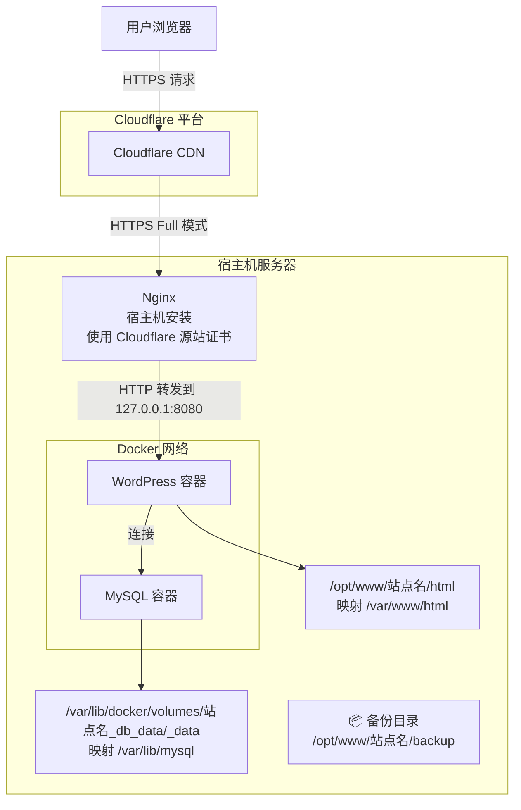

```mermaid
graph TD
    A[用户浏览器] -->|HTTPS 请求| B[Cloudflare CDN]

    B -->|HTTPS Full 模式| C[Nginx<br>宿主机安装<br>使用 Cloudflare 源站证书]
    C -->|HTTP 转发到 127.0.0.1:8080| D[WordPress 容器]
    D -->|连接| E[MySQL 容器]

    %% WordPress volume mapping
    D --> F["/opt/www/站点名/html<br>映射 /var/www/html"]

    %% MySQL volume mapping
    E --> G["/var/lib/docker/volumes/站点名_db_data/_data<br>映射 /var/lib/mysql"]

    %% 备份目录
    H["📦 备份目录<br>/opt/www/站点名/backup"]

    subgraph 宿主机服务器
        C
        F
        G
        H
        subgraph Docker 网络
            D
            E
        end
    end

    subgraph Cloudflare 平台
        B
    end


```
